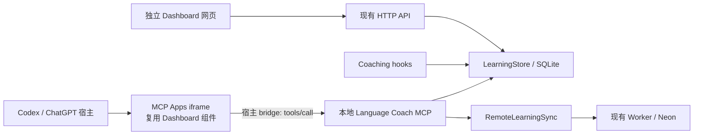

# Language Coach 插件 UI 升级技术方案

日期：2026-09-29。状态：方案，尚未实施或完成目标客户端验证。

建议复用现有 React Dashboard，增加 MCP Apps 运行入口和数据适配层，通过 MCP UI resource 交给宿主渲染。首期实现学习记录、统计和语言设置；随后接入对话面板和全局侧栏。保留本地 SQLite、现有 coaching hooks 和独立网页。

## 1. 先确认平台边界

用户提供的 [Plugin Extensions](https://developers.openai.com/plugins/build/extensions) 页面明确描述 ChatGPT 的扩展入口，并给出 `global` 和 `thread` entrypoint 示例。它没有明确保证独立 Codex 桌面客户端支持全部扩展。目标客户端的 MCP Apps 渲染、侧栏入口、面板入口和设置入口需要分别验证。

基础 UI 遵循 MCP Apps：工具通过 `_meta.ui.resourceUri` 关联 HTML resource，页面通过宿主 bridge 与 MCP 服务交互。OpenAI 的扩展入口是附加能力。不能仅在 plugin manifest 里填一个网页 URL，就获得原生插件页面。[官方 UI 指南](https://developers.openai.com/plugins/build/chatgpt-ui)

平台验证结果决定交付形态：

| 目标宿主实际能力 | 交付形态 |
| --- | --- |
| 支持 MCP Apps 和 thread entrypoint | 对话侧面板打开 Dashboard |
| 支持 MCP Apps 和 global entrypoint | 侧栏打开完整应用 |
| 只支持 MCP Apps | 由打开工具触发 UI，按宿主允许的展示模式运行 |
| 不渲染 MCP Apps | 继续使用现有 localhost Dashboard；在提供浏览器面板的 Codex 环境中，可由助手打开网页作为过渡 |

浏览器面板是过渡展示方案，不能作为原生扩展入口验收结果。本文中的 SDK 接线示例为设计草图；安装具体 SDK 后，需以其类型和目标客户端行为为准。

## 2. 当前仓库与差距

| 当前模块 | 已有能力 | 本次改造 |
| --- | --- | --- |
| `packages/plugin/scaffold` | `.codex-plugin/plugin.json`、`.mcp.json`、skills、hooks | 升级打包结构，单独维护 Codex 插件 skill，定义 Dashboard 打开与降级流程 |
| `packages/mcp/src/index.ts` | 本地 stdio MCP；笔记、进度、语言设置和同步工具 | 注册 UI resource、打开工具、分页 Dashboard 数据工具 |
| `apps/dashboard` | React/Vite；笔记卡片、统计、设置、Neon 登录 | 分离页面组件、HTTP/MCP transport 和宿主路由 |
| `apps/server` | SQLite + stdio MCP；按需启动 HTTP Dashboard | 读取内嵌 UI bundle，向 MCP 注入资源加载器 |
| `packages/core` | `LearningStore`、DashboardData、分页、远程同步 | 复用业务与数据类型，统一 mutation 后的刷新逻辑 |
| `apps/worker` | 云端 HTTP API、JWT、RLS、设备同步 token | 首期不承担 MCP UI；公开远程插件另行接入 MCP transport/auth |
| `scripts/build-plugin.mjs` | 打包独立 server.mjs 和网页资源，生成版本 | 增加 UI 产物与 manifest 校验，验证复制后可运行 |

最关键的两个差距：

1. `dashboard-api.ts` 使用 `/api/config`、`/api/dashboard` 等同源 URL。MCP UI iframe 的源不是现有 Dashboard HTTP 服务，原样搬进去会访问错误地址。
2. `DashboardApp` 同时承担鉴权、数据加载和页面状态，且页面判断读取 `window.location.pathname`。内嵌入口不能依赖原网站路径或自动走网页登录初始化。

当前 `start_learning_dashboard` 只返回 localhost URL，没有注册 UI resource。`list_learning_notes` 只有 limit，没有完整 Dashboard 的 cursor 分页。不能把这两个工具原样当成内嵌 Dashboard 的数据接口。

### Codex 专用 skill 管理

本次交付以 Codex 为目标，继续使用 `packages/plugin/scaffold/skills/language-coach/SKILL.md` 作为 Codex 插件的 skill 源文件，保留现有 skill 名称。不为同一个打开流程再新增一个竞争触发的 skill，也不把 Codex 专用指令写进共享 React 页面或业务 core。

该 skill 明确管理：

- 用户请求打开学习中心时，优先使用已验证可用的 `open_learning_dashboard`，由宿主渲染 UI。
- 原生 UI 工具未提供，或已确认宿主不能渲染时，调用 `start_learning_dashboard`；只有当前环境提供 Codex 浏览器面板工具时才在面板打开返回的 URL，否则提供链接。
- 不把打开工具返回成功等同于页面已显示；区分明确不支持、临时加载错误和未验证状态，避免重复打开。
- 保留学习回顾、语言设置、删除确认与学习材料隐私规则；自动 coaching 仍由 hooks 注入。

skill 定义模型工作流；MCP 注册 resource 与 entrypoint；前端负责实际页面。不能靠 skill 单独创建宿主原生入口，也不能假设插件自带 Codex 的面板工具。

构建时将这份源文件复制到 Codex 发布包的根 `skills/language-coach/SKILL.md`。portable 与 legacy 包共享这份 Codex skill，不单独维护两份内容。若后续增加其他宿主，届时再拆分 `packages/plugin/targets/codex/skills/` 与其他宿主的源目录，并由构建选择目标、输出到标准根 `skills/`；源目录命名本身不提供平台隔离。当前阶段不创建其他宿主 skill，也不承诺跨宿主工作流已可用。

skills 本身并非只有 Codex 支持；官方文档将其定位为 ChatGPT 和 Codex 的工作流层。本方案单独维护 Codex skill，是因为现有 hooks、本地 stdio 与页面打开流程针对 Codex，需要明确目标和验收范围。[官方 skills 说明](https://developers.openai.com/plugins/concepts/skills)

## 3. 推荐架构



本地嵌入页面通过宿主调用当前插件连接的 MCP 工具，读写本地 LearningStore。MCP 管理文件、数据库和同步凭据，iframe 不直接访问 SQLite 或设备 token。

独立网页继续使用 HTTP transport。两种入口共享 React 页面与业务类型，不强求共享登录流程。首期内嵌页面显示同步状态并提供打开现有登录页面的操作；启用/关闭同步仍走已有登录与重认证流程。

这是项目架构建议，不代表目标 Codex 已验证支持 stdio MCP Apps。

## 4. 产品入口与首期范围

| 入口 | 内容 | 优先级 |
| --- | --- | --- |
| 对话面板 | 最近笔记、笔记详情、学习概览 | P0，宿主支持后启用 |
| 全局侧栏 | 完整笔记库、统计、设置 | P1，宿主支持后启用 |
| Dashboard 内的设置页 | 语言对、coaching 开关、同步状态 | P0 |
| 宿主原生 Plugin settings | 轻量语言设置 | P1，独立核验 API |
| Composer mentions / 文件编辑器 | 暂无必要场景 | 后续评估 |

首期不为每次 `save_learning_note` 附加 UI。自动保存只返回简洁文本；用户主动打开学习中心时才展示页面。这样 coaching 不会在每轮对话产生重复组件。

## 5. MCP 接口设计

保留一个 UI 入口工具，方案暂命名为 `open_learning_dashboard`：承载 UI resource 与 entrypoint 元数据，并返回轻量初始快照。这个名称和单独新增工具并非规范硬性要求；也可复用一个职责合适的现有工具。保留独立入口是本项目的设计选择，避免普通数据读取或自动保存触发页面展示。`start_learning_dashboard` 继续用于旧客户端和独立网页。

入口工具不等于“每次打开都必须由模型调用的命令”。官方当前示例把 `global`/`thread` entrypoint 声明在 MCP App 工具的 `_meta` 上，因此仍需一个工具承载入口注册；支持入口的宿主允许用户从界面直接进入应用，不需要先发送一句话让模型调用。自然语言请求打开 Dashboard 时，Codex skill 才引导模型使用该工具。具体入口调用参数与生命周期以 SDK 和目标宿主实现为准。[官方入口示例](https://developers.openai.com/plugins/build/extensions)

新增 `get_learning_dashboard_data({ limit, cursor? })`：直接复用 `store.getDashboardData()`，返回 profile、notes、progress、notesPage 和脱敏 sync 状态。limit 建议默认 50，上限 100；不返回设备 token、本地路径或 JWT。

复用 `update_language_profile`、`delete_learning_note` 和必要时的 `sync_learning_notes`。按照实际作用声明只读、幂等、破坏性等 annotations。删除沿用现有用户确认要求；UI 在明确选择笔记并确认后才调用，宿主审批仍由宿主管理。

工具定义示意：

```ts
const dashboardMetadata = {
  ui: { resourceUri: "ui://language-coach/dashboard/v1.html" },
  "openai/ui": {
    entrypoints: [{ type: "thread" }, { type: "global" }],
  },
};
// 把 dashboardMetadata 放在 open_learning_dashboard 的 _meta 中。
// 入口声明来自官方示例；目标宿主是否呈现，需要实际验证。
```

不要猜测 settings entrypoint 的字段。实施时按官方链接的 SDK guide 和安装版本的类型完成注册。读取工具与渲染工具分离，只给打开工具附加 UI resource。[Extensions](https://developers.openai.com/plugins/build/extensions)、[MCP server](https://developers.openai.com/plugins/build/mcp-server)

返回数据按用途划分：`content` 提供模型可读的简洁结果，`structuredContent` 放模型需要的结构化数据；仅组件需要的批量数据优先由 UI 主动读取。UI-only 工具可在验证宿主支持后采用 `_meta.ui.visibility: ["app"]`，现有模型工具保持可用。[UI reference](https://developers.openai.com/plugins/reference)

## 6. 前端改造

将当前 Dashboard API 抽成接口，例如 `LearningDashboardClient`：

```ts
interface LearningDashboardClient {
  getDashboard(cursor?: string): Promise<DashboardData>;
  updateProfile(input: ProfileUpdate): Promise<LanguageProfile>;
  deleteNote(id: string): Promise<{ deleted: boolean }>;
}
```

实现 `HttpDashboardClient` 和 `McpDashboardClient`。后者用 MCP Apps SDK 的 `App` 建立连接，通过宿主 tool-call API 获取数据；解包 `structuredContent`，校验 schema，并处理 `isError`。使用 SDK，避免自己实现 postMessage 握手和来源校验。

新增 `src/mcp-app/main.tsx`，启动顺序为：注册 bridge 回调 → connect → 接收初始结果/宿主上下文 → 获取数据 → 渲染。连接超时显示可重试错误；不得悄悄退回对 iframe 同源 `/api` 的请求。

拆分 `DashboardApp` 为可注入 client 的页面容器与网页登录容器。复用卡片、图表、笔记和设置组件。嵌入路由用 MemoryRouter 或受控 page state，默认打开 overview，接受受校验的 noteId/page；独立网站保留现有 BrowserRouter。

UI 保留筛选、选中笔记和滚动状态；保存设置或删除后，以服务端最新快照更新数据。面板打开/重新获得焦点和 mutation 后刷新。hooks 在另一进程写 SQLite，不能只依靠 MCP 进程内事件刷新。首期可加低频轮询，组件隐藏时停止；后续再研究宿主事件协议。

适配窄面板、深浅主题和键盘交互。宿主 bridge 提供的主题/尺寸是输入，不能假定全屏。原有全局键盘与滚轮处理需要检查，避免抢占宿主快捷键。

## 7. UI resource 与构建

引入 `@modelcontextprotocol/ext-apps`；需要 OpenAI 专属入口时引入 `@openai/mcp-extensions`。锁定验证通过的版本，不预设现有 MCP SDK 必须跨大版本升级。

服务器通过 `registerAppResource` 或对应 SDK API 注册 `ui://language-coach/dashboard/v1.html`，返回 `RESOURCE_MIME_TYPE`（`text/html;profile=mcp-app`）的 HTML。修改资源协议或进行不兼容 UI 升级时更换 URI。[官方 UI 指南](https://developers.openai.com/plugins/build/chatgpt-ui)

增加独立 UI build：

```text
apps/dashboard/src/mcp-app/          # 内嵌入口、bridge、MCP client
apps/dashboard/dist-mcp/index.html   # 完整 UI 产物
dist/language-coach/ui/dashboard.html
```

首期把 JS/CSS 内联到 HTML，避免现有 `/assets/*` 相对路径失效；图标/字体内联、改用系统字体或加载明确许可的资源源。需要检查动态 import 和 CSS url，不能只内联入口 JS。

嵌入 UI 的业务请求优先走 bridge，缩小 CSP。外部字体、图片、API 确有需要才列入对应 resource/connect allowlist。首期不通过二层 iframe 包装整个已部署网站，避免额外 CSP、登录 cookie 和本地数据链路问题。

## 8. 插件包升级与兼容

新包采用根 `plugin.json` 和 `mcp.json`，OpenAI 专属界面信息与 hooks 放入 `extensions.com.openai`。保留根 skills、hooks、assets。现有 `.codex-plugin/plugin.json` 是兼容结构；根 inline extension 存在时会替代整个 overlay，两者不会合并。[Package your plugin](https://developers.openai.com/plugins/build/plugins)

建议从同一份配置生成 portable 和 legacy 发布产物，而不是手工维护两个清单。两种包分别验证其 MCP 和 hooks 发现行为。保持插件 name、数据目录和 SQLite schema，版本升级不迁移或删除学习数据。

```text
dist/language-coach/
  plugin.json
  mcp.json
  assets/
  hooks/
  skills/
  mcp/server.mjs
  dashboard/dist/        # 独立网页
  ui/dashboard.html     # MCP Apps
```

更新 build script 的复制列表、requiredFiles、manifest 校验和 CI release 产物检查。版本号从根 package 派生；避免 MCP server、工作区包与生成清单出现多个手工版本来源。

本地团队发布仍使用现有 marketplace。面向公共目录的远程方案需要可访问的 HTTPS MCP endpoint；当前 Worker 只有业务 HTTP API，增加 `mcp.json` URL 并不会使它成为 MCP 服务。远程部署、MCP OAuth 和用户隔离作为后续项目，不能直接复用设备同步 token 为所有读取工具授权。

## 9. 对话上下文与隐私

默认面板展示用户自己的学习记录；不假设当前 threadId 就是 note 的 turnId，两者语义不同。要定位某次纠错，通过明确的 noteId，或新增显式来源映射。

用户点“帮我练习这个句型”时，只分享选定 pattern、example 或必要的纠错文本。使用 MCP Apps 的 model-context/message 能力前检测宿主支持情况。不开启全量笔记或账号信息的自动上下文同步。

同步 token 仍由 MCP 进程保管。内嵌 UI 中暂不初始化 Neon 网页登录；在既有网页登录流程完成后重新读取本地同步状态。将来若做原生账户设置，应另行验证宿主的外部登录、回调和凭据交接。

## 10. 最终决策

采用“共享 Dashboard 组件 + MCP Apps bridge + 按宿主能力开放扩展入口”。先验证独立 Codex 支持，再实现本地完整闭环。原生入口和公共远程插件分别验收；既有网页、hooks 与 SQLite 保持连续可用。
